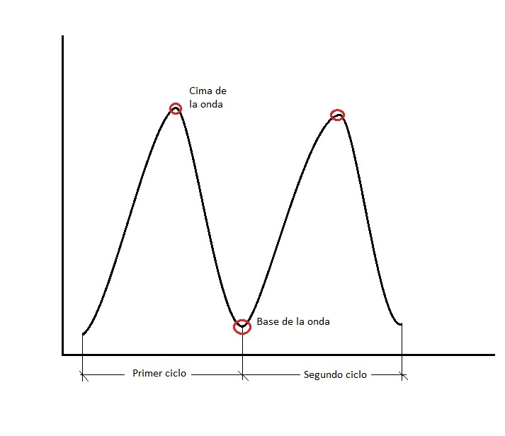
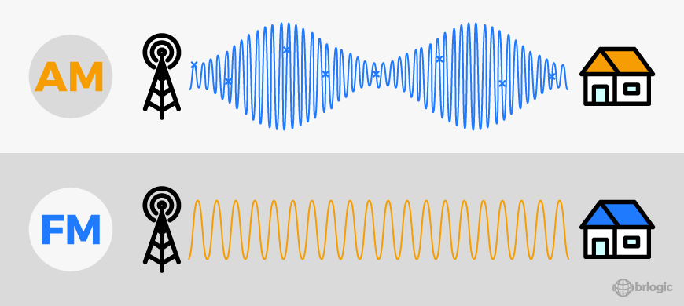
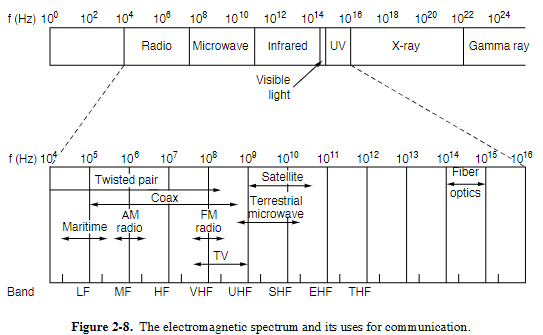
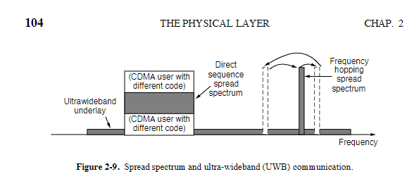

# Antenas

## - Características principales de un campo electromagnético:

- Los campos electromagnéticos tienen propiedades como intensidad, frecuencia, longitud de onda y amplitud.
- Las ondas electromagnéticas están formadas por ciclos periódicos, y cada ciclo tiene un periodo.
  
- La frecuencia es el número de ciclos que ocurren por segundo y se mide en Hertz (Hz). Es inversamente proporcional al periodo de la onda.
- Poseen otro elemento llamado fase (phase). Dando por resultado; amplitud modulada, frecuencia modulada y fase modulada. (también conocidas como ondas AM, FM, PM)
- La amplitud modulada (AM) consiste en variar la amplitud de una onda portadora en función de la señal de información. Por ejemplo, en la radio AM, la amplitud de la onda portadora cambia para transmitir el audio de una emisora.
  Este proceso permite transmitir información a través de una señal portadora, y puede combinarse con técnicas de multiplexación para enviar múltiples señales a través de un mismo canal.
- La frecuencia modulada (FM) consiste en variar la frecuencia de una onda portadora en función de la señal de información. Por ejemplo, en la radio FM, la frecuencia de la onda portadora cambia para transmitir el audio de una emisora. A diferencia de la amplitud modulada (AM), la FM es menos susceptible a interferencias y ruido, lo que la hace ideal para transmitir señales de alta calidad, como música y voz.
  Entre mayor frecuencia, mayor el riesgo de perder los datos, en menos tiempo pueden ocurrir más cosas que estropeen la conexión.
  
- La fase modulada (PM) consiste en variar la fase de una onda portadora en función de la señal de información. En este caso, la posición de la onda dentro de su ciclo cambia para representar los datos transmitidos. Se utiliza comúnmente en sistemas de comunicación digital, como en las técnicas de modulación por desplazamiento de fase (PSK, Phase Shift Keying). Aunque menos común que la amplitud modulada (AM) y la frecuencia modulada (FM) en aplicaciones analógicas, la PM es fundamental en tecnologías modernas como las redes inalámbricas y las comunicaciones satelitales.

- Ahora hablando de la frecuencia, al aumentar significativamente su valor, las ondas electromagnéticas pueden cambiar de comportamiento y pertenecer a diferentes regiones del espectro electromagnético (como microondas, luz visible o rayos X). Sin embargo, frecuencias extremadamente altas pueden presentar desafíos en la transmisión de datos debido a la mayor susceptibilidad a interferencias y pérdidas.
  
- Los medios de transmisión como el par trenzado y la fibra óptica tienen características diferentes:

  - El **par trenzado** (como el cable UTP) utiliza un diseño trenzado para minimizar el ruido y las interferencias electromagnéticas, lo que lo hace adecuado para redes locales (LAN). Sin embargo, su ancho de banda es limitado en comparación con otros medios.
  - La **fibra óptica** utiliza pulsos de luz para transmitir datos, lo que le permite alcanzar velocidades extremadamente altas y cubrir largas distancias con baja atenuación. Además, tiene un ancho de banda mucho mayor que el par trenzado, lo que la hace ideal para aplicaciones de alta velocidad y redes de larga distancia.

  

  - El DSSS utiliza una secuencia de códigos para expandir la señal de datos en un ancho de banda más amplio. Es una técnica eficiente que permite que múltiples señales compartan la misma banda de frecuencia mediante códigos diferentes, un método conocido como Code Division Multiple Access (CDMA). Este enfoque es la base de las redes móviles 3G y también se utiliza en sistemas como el GPS. Además, DSSS puede tolerar interferencias y desvanecimientos, ya que solo se pierde una fracción de la señal deseada. También se empleó en versiones antiguas del protocolo 802.11b para redes inalámbricas LAN.

  - ¿Qué pasa si hay una montaña en medio de dos antenas?
    - Lo mejor es tener satelites que reboten las señales.

- Cantidad de frecuencia que lleva un medio es el ancho de banda.
- A mayor cantidad de armónicos, mayor calidad de la señal:

  - Los **armónicos** son componentes de frecuencia múltiplos de la frecuencia fundamental de una señal. En términos simples, son las frecuencias adicionales que se suman a la señal principal.
  - Una señal con más armónicos puede representar mejor la forma de onda original, lo que resulta en una mayor fidelidad y calidad en la transmisión de datos o audio.
  - Sin embargo, es importante tener en cuenta que un exceso de armónicos puede generar interferencias o ruido si no se manejan adecuadamente, especialmente en sistemas de comunicación.

- **Fórmula de Shannon para la capacidad de un canal ruidoso**:
  La capacidad máxima de un canal de comunicación con ruido está dada por la siguiente fórmula:

  \[
  C = B \cdot \log_2(1 + \frac{S}{N})
  \]

  Donde:

  - \( C \): Capacidad del canal (en bits por segundo).
  - \( B \): Ancho de banda del canal (en Hz).
  - \( S \): Potencia de la señal (en vatios).
  - \( N \): Potencia del ruido (en vatios).
  - \( \frac{S}{N} \): Relación señal-ruido (SNR, Signal-to-Noise Ratio).

  - **Explicación**:
    - Esta fórmula establece el límite teórico de la cantidad máxima de información que se puede transmitir a través de un canal con ruido.
    - A mayor ancho de banda (\( B \)) o mejor relación señal-ruido (\( S/N \)), mayor será la capacidad del canal.
    - Es una base fundamental en las telecomunicaciones y se utiliza para diseñar sistemas de transmisión eficientes.
- Importante la parte de switching del cap 2.
- Probablemente sea necesario identificar cuándo utilizar fibra o par trensado según casos, dió el ejemplo de conectar dos edificios.