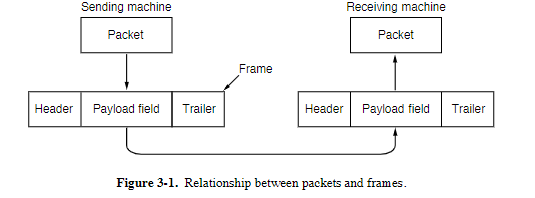
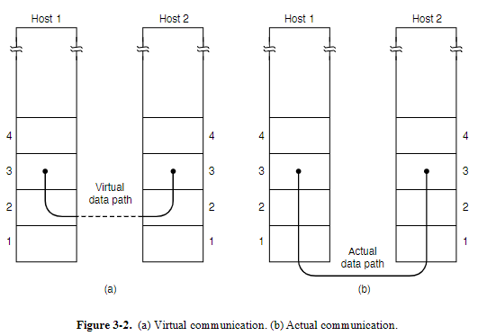
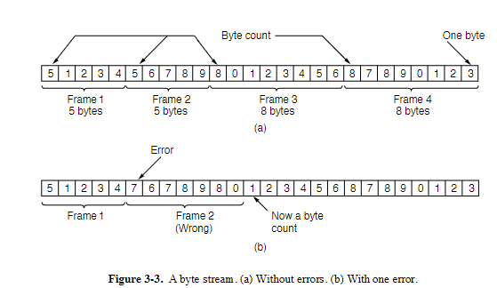
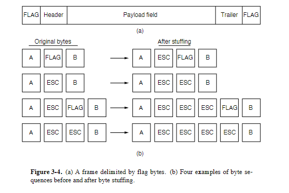
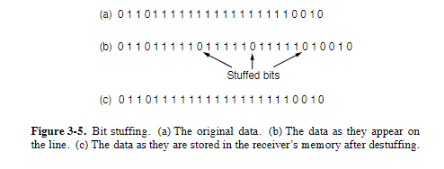
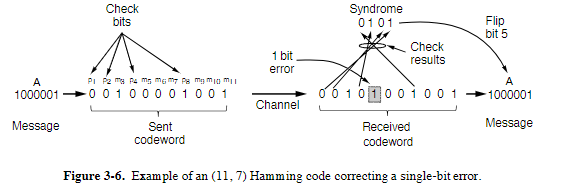
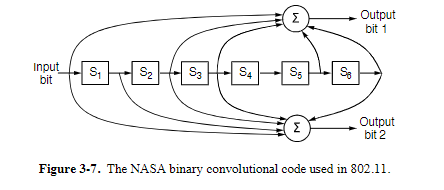
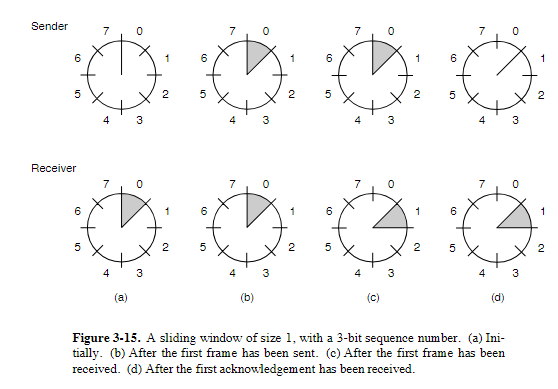
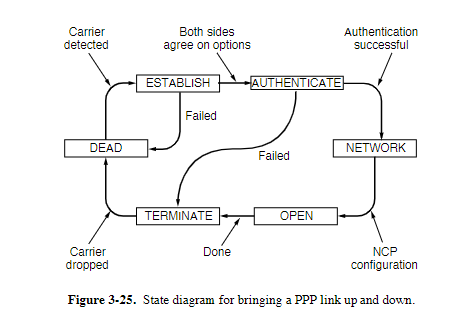
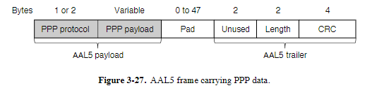

# Data Link Layer Design Issues

- En esta imagen se puede apreciar que se dividen en tramas a la hora de transmitir los datos, iniciando por un encabezado que da la premisa de lo que se leerá, dando un inicio del mensaje y un final (antes del Trailer). Se menciona que después de la data que se envía, el mensaje por decirlo así puede tener metadata luego del final del mensaje, debido a diversos casos hipotéticos, por ejemplo que el que recibe el mensaje estuviera apagado y el mensaje entrara en espera, entre otros.

## Métodos de Envío

1. **Unacknowledged connectionless service**  
   Yo envío y no me interesa saber nada, siquiera saber si el mensaje llegó, por ejemplo una emisora de radio, no sabe si lo están escuchando.

2. **Acknowledged connectionless service**  
   Que yo envíe el mensaje y me pueda quedar esperando la respuesta, esto en caso de que la otra persona conteste.

3. **Acknowledged connection-oriented service**  
   Conexión completa, como una llamada telefónica que es completamente en vivo.

## Framing Methods

1. **Byte Count**  
   Este método utiliza un campo en el encabezado que indica la cantidad de bytes en la trama. Esto permite al receptor saber exactamente dónde termina una trama y comienza la siguiente. Sin embargo, si el campo de conteo de bytes se corrompe, puede causar problemas de sincronización.  
   

2. **Byte Stuffing**  
   En este método, se utilizan caracteres especiales para marcar el inicio y el final de una trama. Si el carácter especial aparece en los datos, se "escapa" insertando un carácter adicional para evitar confusiones. Esto asegura que los datos no interfieran con los delimitadores de trama.

3. **Bit Stuffing**  
   Similar al byte stuffing, pero a nivel de bits. Se utiliza una secuencia especial de bits para marcar el inicio y el final de una trama. Si esta secuencia aparece en los datos, se inserta un bit adicional para evitar confusiones. El problema del siguiente ejemplo es que la trama o el mensaje no tiene tamaño fijo, esto aumenta el costo.  
   

4. **Physical Layer Coding Violations**  
   Este método utiliza señales específicas en la capa física que no se usan normalmente para datos, para indicar el inicio y el final de una trama. Es común en sistemas donde la capa física tiene un conjunto limitado de señales válidas.  
   

---

# Error Control

- No se considera tanto el solucionar errores sino ubicarlos.  
  Para garantizar que todas las tramas lleguen al destino en el orden correcto, se utiliza un mecanismo de retroalimentación entre el emisor y el receptor. Esto es especialmente importante en servicios confiables y orientados a conexión.

- El objetivo es garantizar que cada trama sea entregada al destino **exactamente una vez**, ni más ni menos. Este manejo de temporizadores y números de secuencia es una tarea clave de la capa de enlace de datos (y también de capas superiores).

- Dependiendo del tipo de red, vale o no vale la pena el error control:
  - En WiFi no vale la pena por su costo.
  - En fibra óptica ni se toma en cuenta por lo acertada que es la conexión.
  - En Ethernet solo se busca identificar si hubo error, no corregirlos.

---

# Flow Control

Otro problema importante en la capa de enlace de datos (y en capas superiores) es qué hacer cuando un emisor quiere transmitir datos más rápido de lo que el receptor puede procesarlos. Esto puede ocurrir, por ejemplo, cuando un servidor potente envía datos a un dispositivo más lento, como un smartphone, lo que puede saturar al receptor y provocar pérdida de datos.

## Métodos para controlar el flujo

1. **Control de flujo basado en retroalimentación**

   - El receptor envía información al emisor para darle permiso de enviar más datos o para informarle sobre su estado.
   - Ejemplo: El receptor puede indicar al emisor cuántas tramas puede manejar antes de necesitar una pausa.

2. **Control de flujo basado en la tasa**
   - El protocolo limita la velocidad a la que el emisor puede transmitir datos, sin depender de retroalimentación del receptor.
   - Este método es más común en la capa de transporte.

## Enfoque en la capa de enlace

En la capa de enlace de datos, se utiliza principalmente el **control de flujo basado en retroalimentación**. Las reglas del protocolo definen cuándo el emisor puede enviar la siguiente trama. Por ejemplo:

- Durante la configuración de la conexión, el receptor puede indicar: "Puedes enviarme **n** tramas ahora, pero no envíes más hasta que te lo indique".

Este mecanismo asegura que el receptor no se vea abrumado, incluso si el emisor es mucho más rápido.

---

# Error Detection and Correction

La detección y corrección de errores es un aspecto crucial en la capa de enlace de datos, especialmente en canales ruidosos, y también en capas superiores, como en medios en tiempo real y distribución de contenido.

## Puntos clave

1. **Códigos de detección de errores**

   - Son ampliamente utilizados en las capas de enlace, red y transporte.
   - Permiten identificar errores en los datos transmitidos para tomar medidas correctivas.

2. **Códigos como herramientas matemáticas**
   - Los códigos de error se basan en matemáticas avanzadas, como campos de Galois o matrices dispersas.
   - Es recomendable usar códigos probados y confiables en lugar de intentar crear uno propio.

## Enfoque práctico

- Muchos estándares de protocolos reutilizan los mismos códigos debido a sus buenas propiedades.
- En este contexto, se estudiará un código simple para comprender los conceptos básicos y luego se describirán códigos avanzados que se usan en la práctica.

Este enfoque permite entender los compromisos entre simplicidad y eficiencia, y cómo los códigos avanzados se aplican en sistemas reales.

---

# Error-Correcting Codes

Los códigos de corrección de errores son fundamentales para garantizar la integridad de los datos en canales ruidosos. Examinaremos cuatro tipos de códigos de corrección de errores:

1. **Hamming Codes**
   
2. **Binary Convolutional Codes**
   
3. **Reed-Solomon Codes**
4. **Low-Density Parity Check (LDPC) Codes**

## Conceptos clave

- **Redundancia**  
  Los códigos añaden bits redundantes a los datos enviados. Una trama consta de:

  - **m** bits de datos (mensaje).
  - **r** bits redundantes (de verificación).

- **Códigos por bloques**  
  Los bits redundantes (**r**) se calculan como una función de los bits de datos (**m**). En un código sistemático, los bits de datos se envían directamente junto con los bits de verificación.

- **Códigos lineales**  
  Los bits redundantes se calculan como una función lineal de los bits de datos, utilizando operaciones como XOR o suma módulo 2. Esto permite codificación eficiente mediante multiplicaciones matriciales o circuitos lógicos simples.

## Notación

- **n**: Longitud total del bloque (n = m + r).
- **(n, m) Code**: Código que describe un bloque con **n** bits totales y **m** bits de datos.
- **Tasa del código (rate)**: Fracción de bits útiles en el bloque, calculada como **m/n**.

  - Ejemplo: Una tasa de 1/2 significa que la mitad de los bits son redundantes (para canales ruidosos).
  - Una tasa cercana a 1 se usa en canales de alta calidad, con pocos bits redundantes.

    Estos códigos permiten detectar y corregir errores en los datos transmitidos, asegurando la confiabilidad de la comunicación, incluso en condiciones adversas.

---

# Initial Simplifying Assumptions

Para entender mejor cómo funcionan las capas física, de enlace de datos y de red, se hacen las siguientes suposiciones iniciales:

## Procesos independientes

- Se asume que las capas física, de enlace de datos y de red son **procesos independientes** que se comunican enviando mensajes entre sí.
- Una implementación común es que:
  - Parte de la capa física y de enlace de datos se ejecuta en hardware dedicado, como una **NIC (Network Interface Card)**.
  - El resto de la capa de enlace y la capa de red se ejecutan en la CPU principal como parte del sistema operativo, generalmente como un **controlador de dispositivo**.
- Otras implementaciones posibles incluyen:
  - Procesos ejecutados en hardware dedicado, como un **acelerador de red**.
  - Procesos ejecutados completamente en la CPU principal, como en un **radio definido por software**.
- Tratar las capas como procesos separados facilita la discusión y enfatiza su independencia.

## Comunicación unidireccional

- Se asume que la máquina **A** envía un flujo continuo de datos a la máquina **B** utilizando un servicio confiable y orientado a conexión.
- La máquina **A** tiene un suministro infinito de datos listos para enviar y nunca necesita esperar a que se produzcan datos.
- Más adelante, se considerará el caso en el que **B** también envíe datos a **A** simultáneamente.

## Máquinas y procesos confiables

- Se asume que las máquinas no fallan ni se reinician.
- Estos protocolos manejan errores de comunicación, pero no problemas causados por fallos o reinicios de los equipos.

## Datos como paquetes puros

- Para la capa de enlace de datos, el paquete recibido desde la capa de red es **puro dato**.
- La capa de enlace no se preocupa por cómo la capa de red interpreta el paquete (por ejemplo, si contiene un encabezado).

# Sliding Window Protocols

Los protocolos de ventana deslizante son protocolos bidireccionales que permiten una transmisión eficiente y ordenada de datos. Examinaremos sus características principales:

## Conceptos clave

1. **Números de secuencia**

   - Cada trama enviada tiene un número de secuencia, que varía de 0 a un máximo determinado por \( 2^n - 1 \), donde \( n \) es el número de bits asignados al campo de secuencia.
   - Ejemplo: En el protocolo de parada y espera, \( n = 1 \), por lo que los números de secuencia son 0 y 1.

2. **Ventanas de envío y recepción**

   - El emisor mantiene una **ventana de envío**, que contiene los números de secuencia de las tramas que puede enviar pero que aún no han sido reconocidas (acknowledged).
   - El receptor mantiene una **ventana de recepción**, que contiene los números de secuencia de las tramas que puede aceptar.
   - Las ventanas pueden tener tamaños fijos o dinámicos, dependiendo del protocolo.

3. **Funcionamiento de la ventana deslizante**
   - Cuando el emisor envía una trama, esta se agrega a la ventana de envío.
   - Al recibir un reconocimiento (ACK), el límite inferior de la ventana de envío se desplaza hacia adelante, eliminando las tramas reconocidas.
   - De manera similar, la ventana de recepción se ajusta a medida que se reciben tramas válidas.

## Requisitos

- Las tramas deben entregarse al destino en el **mismo orden** en que fueron enviadas.
- El canal de comunicación debe comportarse como un medio confiable ("similar a un cable"), entregando las tramas en el orden correcto.

## Ejemplo

- Cuando llega un nuevo paquete desde la capa de red, se le asigna el siguiente número de secuencia disponible, y el límite superior de la ventana de envío se incrementa.
- La ventana de envío mantiene un registro continuo de las tramas no reconocidas.

Este mecanismo asegura una transmisión eficiente y confiable, incluso en canales con alta latencia o pérdida de datos.

# One-Bit Sliding Window

    - Va calculando cuánto puede recibir y le avisa a quien le envía para que le mande las necesarias, pero requiere muy buena conexión.

# Go Back N

    - Deja previsto cuánto le envía y deja un tiempo prudencial para mandarle el siguiente bus. Pero deja la duda de cuánto es un tiempo prudencial.

# DATA LINK PROTOCOLS IN PRACTICE

## Packet over SONET

**SONET** (Synchronous Optical Network) es el protocolo de capa física más utilizado en enlaces de fibra óptica de área amplia, como los que forman el backbone de las redes de comunicaciones, incluyendo el sistema telefónico. Proporciona un flujo continuo de bits a una velocidad definida, por ejemplo, **2.4 Gbps** para un enlace OC-48. Este flujo de bits se organiza en cargas útiles de tamaño fijo que se repiten cada **125 μs**, independientemente de si hay datos de usuario para enviar.

## Mecanismo de Framing

Para transportar paquetes a través de estos enlaces, se necesita un mecanismo de framing que distinga los paquetes ocasionales del flujo continuo de bits. **PPP (Point-to-Point Protocol)** se utiliza en routers IP para proporcionar este mecanismo.

### Características principales de PPP:

1. **Método de framing**:

   - Delimita claramente el final de un frame y el inicio del siguiente.
   - Maneja la detección de errores.

2. **Protocolo de control de enlace (LCP)**:

   - Configura líneas, las prueba, negocia opciones y las cierra de manera ordenada cuando ya no son necesarias.

3. **Protocolo de control de red (NCP)**:
   - Permite negociar opciones de la capa de red de manera independiente del protocolo de red utilizado.
   - Hay un NCP diferente para cada protocolo de capa de red soportado.

### Diferencias entre PPP y HDLC:

- **PPP es orientado a bytes**, mientras que **HDLC es orientado a bits**:

  - PPP utiliza byte stuffing, y todos los frames tienen un número entero de bytes.
  - HDLC utiliza bit stuffing y permite frames con tamaños no enteros (por ejemplo, 30.25 bytes).

- **Modo de transmisión**:
  - HDLC proporciona transmisión confiable con ventana deslizante, ACKs y temporizadores.
  - PPP puede proporcionar transmisión confiable, pero rara vez se usa en la práctica. En su lugar, se utiliza un **modo no numerado** para ofrecer un servicio sin conexión y sin reconocimiento.

### Formato de Frame PPP

- Todos los frames PPP comienzan con el byte de bandera estándar de HDLC: **0x7E (01111110)**.
- Si el byte de bandera aparece en el campo de datos, se utiliza **byte stuffing**:

  - Se inserta un byte de escape **0x7D**.
  - El byte siguiente se XOR con **0x20** para evitar confusiones.
  - Ejemplo: **0x7D 0x5E** representa el byte de bandera **0x7E**.

- Al recibir un frame, el receptor:
  - Busca **0x7D**, lo elimina y aplica XOR con **0x20** al siguiente byte.
  - Solo se necesita un byte de bandera entre frames, pero se pueden usar múltiples bytes de bandera para llenar el enlace cuando no hay frames que enviar.

Este mecanismo asegura una transmisión eficiente y confiable en enlaces SONET, integrando características avanzadas de framing y control.

---

# ADSL (Asymmetric Digital Subscriber Loop)

**ADSL** conecta millones de hogares a Internet a velocidades de megabits por segundo utilizando el mismo bucle local telefónico que se usa para el servicio telefónico tradicional. Un **DSL modem** en el hogar envía bits a través del bucle local hacia un dispositivo llamado **DSLAM (DSL Access Multiplexer)** en la oficina local de la compañía telefónica. Desde allí, los paquetes IP ingresan a la red del ISP para llegar a su destino en Internet.

## Protocolo y Dispositivos

El esquema de protocolos y dispositivos utilizados con ADSL se muestra en la siguiente figura:

- Dentro del hogar, un PC envía paquetes IP al módem DSL utilizando un enlace como Ethernet.
- El módem DSL envía los paquetes IP al DSLAM utilizando los protocolos que se describen a continuación.
- En el DSLAM, los paquetes IP se extraen y se envían a la red del ISP.

## Pila de Protocolos en ADSL

1. **Capa física ADSL**:

   - Basada en una modulación digital llamada **OFDM (Orthogonal Frequency Division Multiplexing)** o **Discrete Multitone**.

2. **ATM (Asynchronous Transfer Mode)**:

   - Tecnología de capa de enlace que utiliza celdas de longitud fija de **53 bytes** (48 bytes de carga útil + 5 bytes de encabezado).
   - Es una tecnología orientada a conexión, donde cada celda lleva un identificador de circuito virtual en su encabezado para enrutar las celdas.

3. **AAL5 (ATM Adaptation Layer 5)**:

   - Mapea datos en una secuencia de celdas ATM mediante un proceso de **segmentación y reensamblaje**.
   - Los frames AAL5 tienen un tráiler que incluye:
     - **Longitud del frame**.
     - **CRC de 4 bytes** para detección de errores.
     - **Padding** para ajustar la longitud total a un múltiplo de 48 bytes.

4. **PPP (Point-to-Point Protocol)**:
   - Proporciona framing, configuración de enlaces y transporte de paquetes IP, similar a su uso en SONET.

## Características de ATM

- **Celdas pequeñas**:
  - Permiten dividir el ancho de banda del enlace físico en pequeñas porciones, útiles para enviar voz y datos en un mismo enlace sin grandes variaciones en el retraso.
- **Diseño político**:
  - El tamaño de 48 bytes para la carga útil fue un compromiso entre Europa (32 bytes) y EE.UU. (64 bytes).

Este conjunto de protocolos asegura una transmisión eficiente y confiable de datos en redes ADSL, integrando tecnologías avanzadas como ATM y AAL5 para manejar tanto voz como datos.

Fractales: 